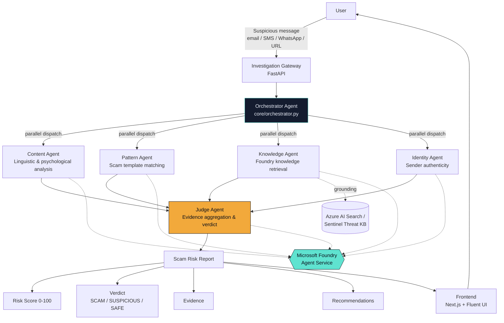
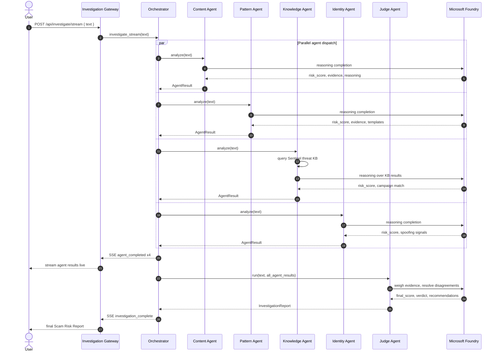

# Sentinel AI — Architecture

## High-Level System Flow



## Multi-Agent Reasoning Sequence



## Repository Structure

```
sentinel-ai/
├── agents/                  # Specialist reasoning agents
│   ├── content_agent.py     # Linguistic & psychological analysis
│   ├── pattern_agent.py      # Scam template & structural matching
│   ├── knowledge_agent.py     # Threat intelligence retrieval
│   ├── identity_agent.py      # Sender authenticity verification
│   └── judge_agent.py          # Final arbiter & verdict generation
│
├── core/                     # Orchestration & Foundry abstraction
│   ├── config.py             # Shared models, enums, config
│   ├── foundry_client.py      # Foundry / Azure OpenAI / mock LLM client
│   ├── foundry_agent_service.py  # Microsoft Foundry Agent Service (threads/tools)
│   └── orchestrator.py         # Parallel agent dispatch + SSE streaming
│
├── api/
│   └── main.py               # FastAPI gateway (REST + SSE)
│
├── data/
│   └── scam_kb.json           # Sentinel threat intelligence knowledge base
│
├── frontend/                  # Next.js + TypeScript + Tailwind UI
│   └── src/
│       ├── app/page.tsx        # Landing + investigation + live reasoning + verdict
│       ├── components/         # AgentNetworkDiagram, RiskGauge, VerdictReport
│       └── lib/                 # Types & SSE API client
│
├── docs/                       # Architecture, demo script, submission assets
├── deploy/                      # Azure deployment scripts & Dockerfiles
├── requirements.txt
├── Dockerfile
├── docker-compose.yml
└── README.md
```
